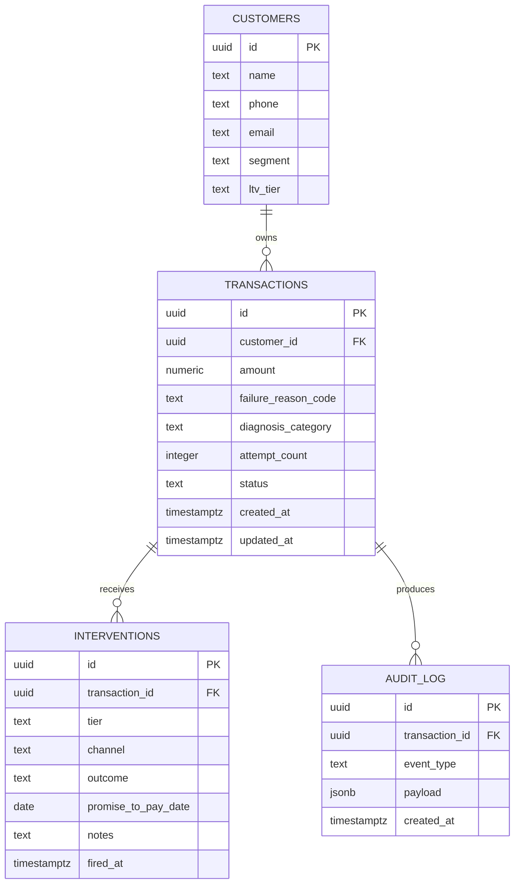

# PayRecover AI — Explainable Revenue Recovery Agent

## System Overview

```mermaid
flowchart TB
    %% Presentation layer
    subgraph UI[Presentation Layer]
        Browser[Browser]
        Dashboard[Streamlit Dashboard\n dashboard.py]
        Navigation[Anchored navigation\nDashboard | Analytics | Actions | Audit]
        Charts[Live metrics, charts, tables\nand hover details]
        Controls[Recovery simulation\nRefresh | Mark paid | Revert]
    end

    %% Data and decision layer
    subgraph CORE[Recovery Intelligence Layer]
        Pipeline[run_pipeline.py\nOrchestrates one recovery round]
        Decision[decision_engine.py\nExplainable seven-rule decision engine]
        Rules[stopping_rules.py\nFresh execution-time safety checks]
        Tracker[outcome_tracker.py\nRecovery attribution and status updates]
    end

    %% Execution layer
    subgraph CHANNELS[Execution Channels]
        Retry[auto_retry_executor.py\nSilent gateway retry]
        WhatsApp[whatsapp_notifier.py\nPayment-link nudge]
        Voice[voice_caller.py\nStructured promise-to-pay call]
        DryRun[DRY_RUN gate\nSimulate and audit without sending]
    end

    %% Persistence
    subgraph DATA[Supabase System of Record]
        Customers[(customers)]
        Transactions[(transactions)]
        Interventions[(interventions)]
        Audit[(audit_log\nappend-only compliance trail)]
        Metrics[(recovery_metrics view)]
    end

    %% External providers
    subgraph PROVIDERS[Optional Live Providers]
        Razorpay[Razorpay payment link\nconfigured link base]
        Twilio[Twilio WhatsApp]
        Bolna[Bolna voice]
        Vapi[Vapi voice fallback]
    end

    Browser --> Dashboard
    Dashboard --> Navigation
    Dashboard --> Charts
    Dashboard --> Controls
    Dashboard --> Metrics
    Dashboard --> Transactions
    Dashboard --> Interventions
    Dashboard --> Audit
    Controls --> Tracker
    Tracker --> Transactions
    Tracker --> Interventions
    Tracker --> Audit

    Pipeline --> Decision
    Decision --> Rules
    Rules --> Retry
    Rules --> WhatsApp
    Rules --> Voice
    Retry --> DryRun
    WhatsApp --> DryRun
    Voice --> DryRun
    DryRun --> Audit
    Retry --> Interventions
    WhatsApp --> Interventions
    Voice --> Interventions

    Decision --> Transactions
    Decision --> Interventions
    Decision --> Audit
    Interventions --> Rules
    Transactions --> Rules

    WhatsApp -. live .-> Twilio
    Voice -. live .-> Bolna
    Voice -. fallback .-> Vapi
    WhatsApp --> Razorpay

    Transactions --> Metrics
    Audit --> Dashboard
    Metrics --> Dashboard

    classDef ui fill:#e7f3ff,stroke:#238cff,stroke-width:2px,color:#06245c
    classDef core fill:#e9fbf4,stroke:#10a978,stroke-width:2px,color:#064d3b
    classDef channel fill:#fff3df,stroke:#ff9d1f,stroke-width:2px,color:#704000
    classDef data fill:#f0eaff,stroke:#7447ff,stroke-width:2px,color:#32127d
    classDef provider fill:#ffecef,stroke:#db5570,stroke-width:2px,color:#68182b

    class Browser,Dashboard,Navigation,Charts,Controls ui
    class Pipeline,Decision,Rules,Tracker core
    class Retry,WhatsApp,Voice,DryRun channel
    class Customers,Transactions,Interventions,Audit,Metrics data
    class Razorpay,Twilio,Bolna,Vapi provider
```

## Decision and Safety Flow

```mermaid
flowchart LR
    Failed[Failed payment] --> Fresh[Read current payment state]
    Fresh --> Resolved{Still failed?}
    Resolved -- No --> Skip[Skip\nAlready resolved]
    Resolved -- Yes --> Fraud{Fraud risk?}
    Fraud -- Yes --> Manual[Manual review\nNo automated contact]
    Fraud -- No --> Cap{Three contact attempts reached?}
    Cap -- Yes --> Manual
    Cap -- No --> Retryable{Retryable failure\nand first attempt?}
    Retryable -- Yes --> Auto[Auto Retry\nZero customer contact]
    Retryable -- No --> High{High value or\nrepeat B2B failure?}
    High -- Yes --> Call[Voice Call\nPromise to pay]
    High -- No --> Customer{Customer action\nand high value?}
    Customer -- Yes --> Call
    Customer -- No --> WhatsApp[WhatsApp\nPayment link nudge]

    Auto --> Recheck[Re-check stopping rules\nimmediately before execution]
    Call --> Recheck
    WhatsApp --> Recheck
    Recheck --> Blocked{Allowed to execute?}
    Blocked -- No --> Refused[intervention_skipped\nReason written to audit]
    Blocked -- Yes --> Execute[Execute or simulate\naccording to DRY_RUN]
    Execute --> Record[Write outcome\nand audit event]
    Record --> Paid{Payment recovered?}
    Paid -- Yes --> Recovered[transactions.status = recovered\ncredit the successful tier]
    Paid -- No --> Pending[Continue audit trail]

    classDef safe fill:#fff3df,stroke:#ff9d1f,stroke-width:2px
    classDef action fill:#e7f3ff,stroke:#238cff,stroke-width:2px
    classDef success fill:#e9fbf4,stroke:#10a978,stroke-width:2px
    classDef stop fill:#ffecef,stroke:#db5570,stroke-width:2px

    class Resolved,Fraud,Cap,Retryable,High,Customer,Blocked,Paid safe
    class Auto,Call,WhatsApp,Execute,Record action
    class Recovered,Pending success
    class Skip,Manual,Refused stop
```



## Runtime Responsibilities

| Layer | Responsibility | Primary files |
|---|---|---|
| Presentation | Dashboard, navigation, metrics, audit filters, demo controls | `dashboard.py` |
| Orchestration | Runs decision and execution stages in cost order | `run_pipeline.py` |
| Decisions | Applies seven explainable first-match rules | `decision_engine.py` |
| Safety | Re-checks current payment, contact cap, fraud, and call window | `stopping_rules.py` |
| Auto-retry | Performs or simulates silent gateway retry | `auto_retry_executor.py` |
| WhatsApp | Builds and sends or simulates payment-link nudge | `whatsapp_notifier.py` |
| Voice | Runs or simulates structured promise-to-pay call | `voice_caller.py` |
| Outcomes | Marks recovery, credits tier, supports demo undo | `outcome_tracker.py` |
| Persistence | Centralizes Supabase reads, writes, and audit events | `db.py` |
| Configuration | Environment, providers, payment links, DRY_RUN | `config.py` |

## Data Contracts



## Key Guarantees

1. **Every decision is explainable.** The selected tier and reason are written to `audit_log`.
2. **Safety is checked twice.** The payment is checked at decision time and immediately before execution.
3. **Dry run is safe by default.** `DRY_RUN=true` composes full messages and call scripts without contacting customers.
4. **Recovery totals are authoritative.** The dashboard derives headline recovery figures from the current transaction status and amount.
5. **The audit trail is append-only.** Sends, refusals, recoveries, and reversions remain traceable.
6. **The pipeline is re-runnable.** Pending interventions are not duplicated unless `--force` is explicitly used.
